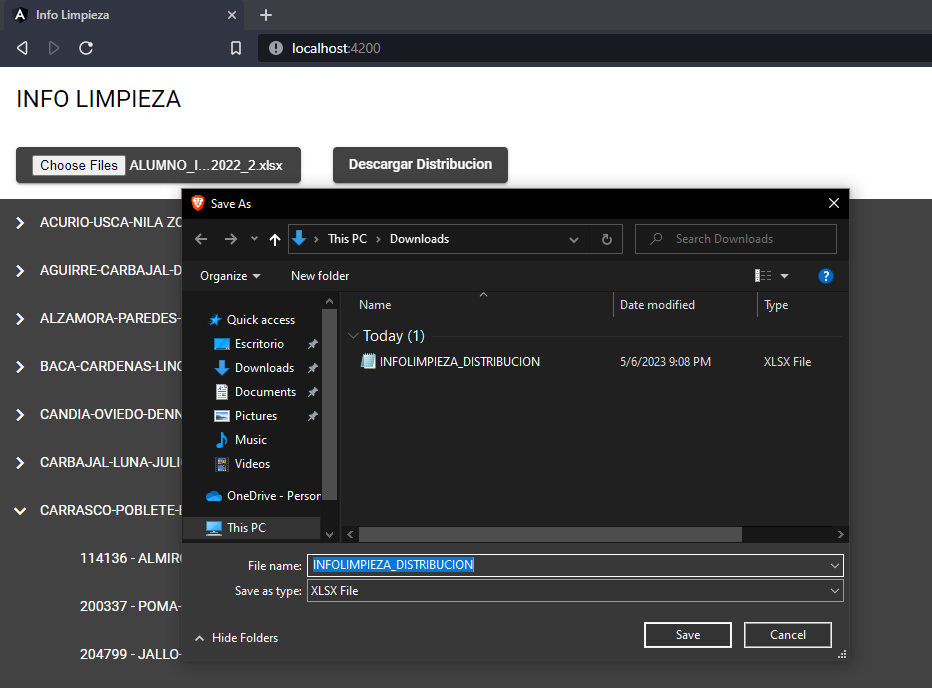

# Angular Project
This single-page Angular app features two buttons: "Upload File" and "Download Distribution." The app reads an xlsx file containing student enrollment data and automatically distributes students into groups with one teacher per group.

### Screenshot

